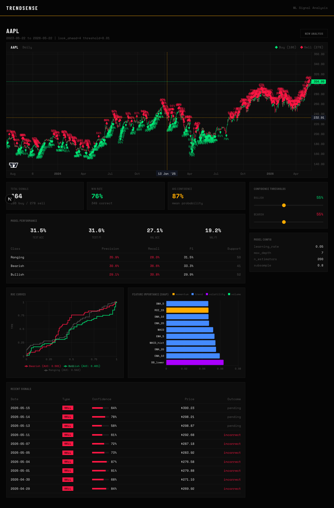
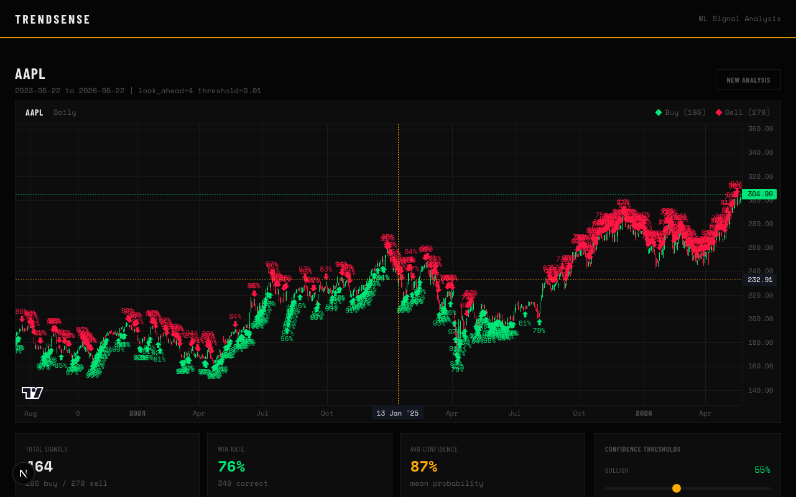
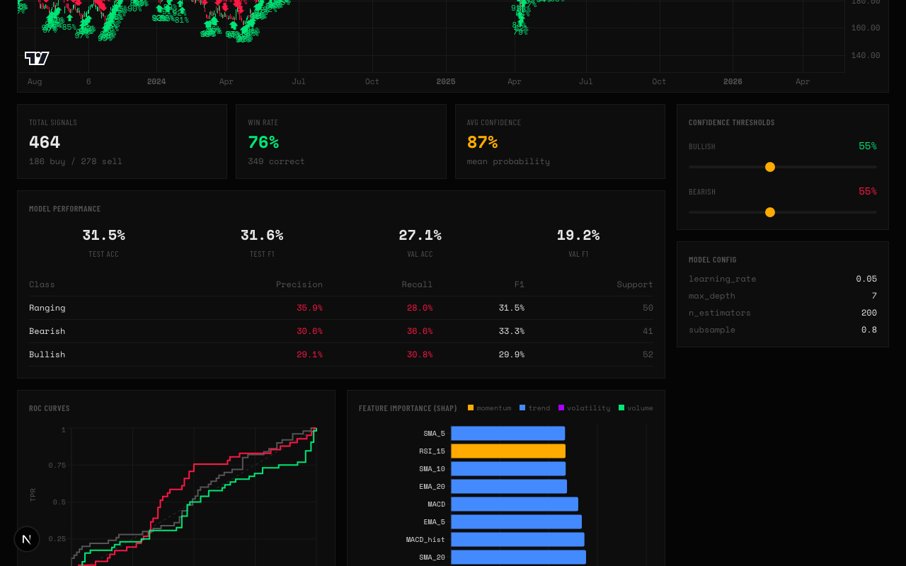

# TrendSense

ML-powered trading signal analyzer. Enter any stock ticker, and it trains an XGBoost classifier on 23 technical indicators to generate buy/sell signals with probability thresholding.

**[Try it live](https://trendsense-iota.vercel.app)** | [Backend API](https://trendsense-production.up.railway.app/health)



## Why I built this

I wanted to test whether a machine learning model trained on technical indicators could produce trading signals with any real predictive edge. The answer, after testing across dozens of tickers, is "sometimes" -- more honest than most tools in this space.

The key idea: instead of hard classification ("is this a buy?"), I use `predict_proba()` and only emit signals when confidence exceeds a user-defined threshold. This trades quantity for precision -- fewer signals, but more reliable ones.

## How it works

Enter a ticker and TrendSense runs the full pipeline end-to-end, streamed to the browser via SSE:

1. Fetches daily OHLCV data from Yahoo Finance
2. Computes 23 technical indicators (RSI, MACD, SMA, EMA, Bollinger Bands, ATR, OBV, etc.)
3. Runs a label grid search over 10 configurations to find the optimal look-ahead window
4. Trains an XGBoost classifier with hyperparameter tuning (GridSearchCV, 3-fold CV)
5. Generates buy/sell signals filtered through adjustable confidence thresholds
6. Evaluates with accuracy, F1, ROC curves, and SHAP feature importance

Data is split chronologically (60/20/20) to prevent look-ahead bias. The model uses three classes (uptrend, downtrend, ranging) rather than binary labels.





## Features

- Real-time pipeline progress streamed via Server-Sent Events
- Interactive candlestick chart (TradingView lightweight-charts) with signal markers
- Adjustable bullish/bearish confidence thresholds that re-filter signals without retraining
- Model performance dashboard: accuracy, F1, classification report, ROC curves per class
- SHAP feature importance showing which indicators drive predictions
- Recent signals table with confidence bars and outcome tracking
- Works with any valid stock ticker, not a fixed list

## Tech stack

**Backend**: Python, FastAPI, XGBoost, scikit-learn, pandas_ta, SHAP, yfinance

**Frontend**: Next.js, TypeScript, Tailwind CSS, lightweight-charts, Recharts

**Deployment**: Railway (backend), Vercel (frontend)

## Local setup

### Backend

```bash
cd backend
python -m venv venv
source venv/bin/activate
pip install -r requirements.txt
uvicorn main:app --reload --port 8000
```

### Frontend

```bash
cd frontend
npm install
echo "NEXT_PUBLIC_API_URL=http://localhost:8000" > .env.local
npm run dev
```

Open http://localhost:3000 and enter a ticker. The pipeline takes 2-4 minutes depending on the grid search.

## Disclaimer

This is a research tool, not financial advice. Model accuracy typically falls between 52-76% on unseen data. Do not trade based solely on these signals.
